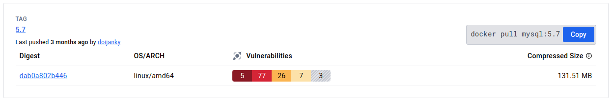
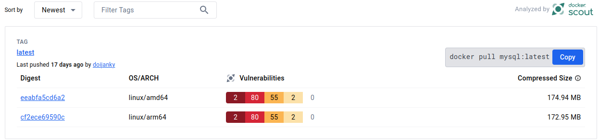
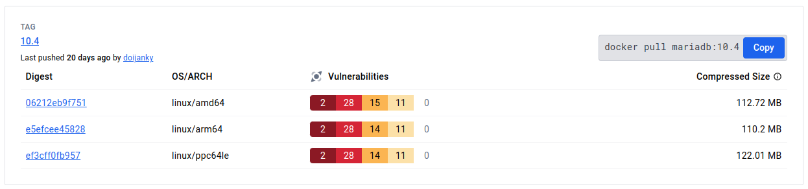
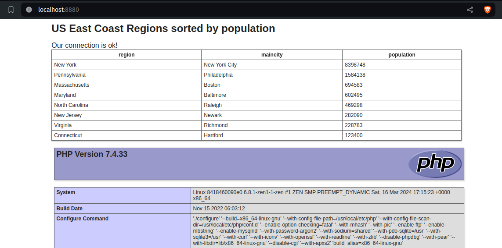
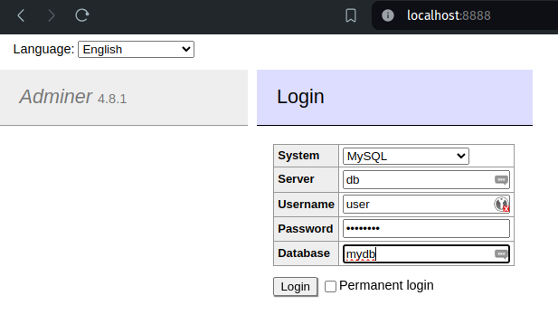
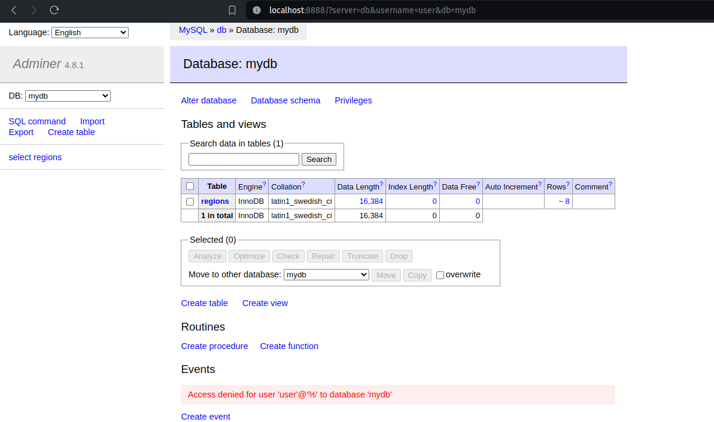
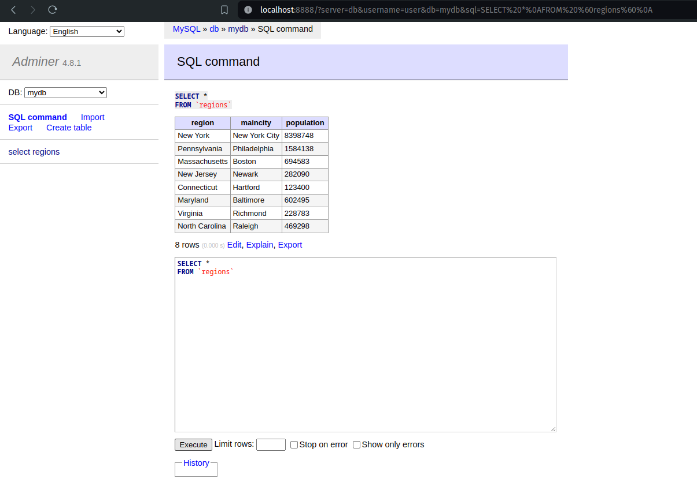
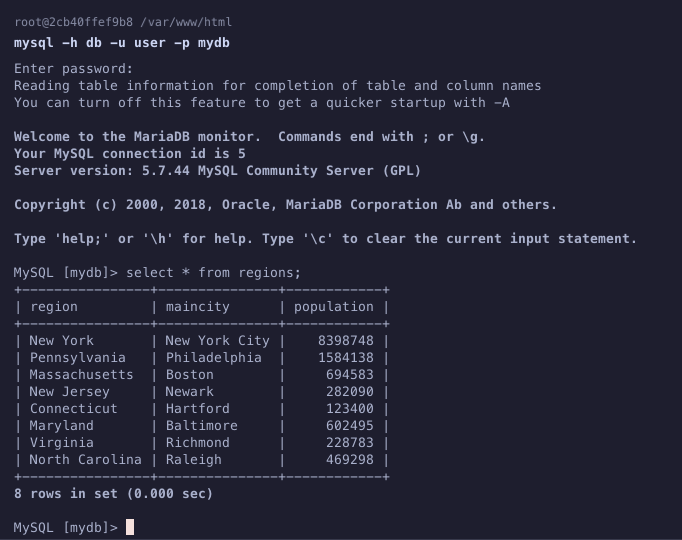
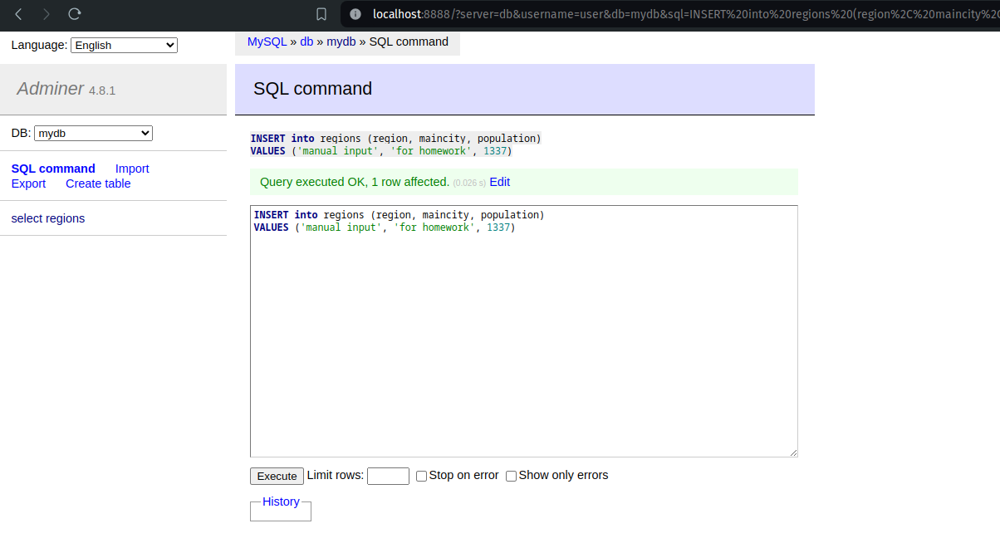
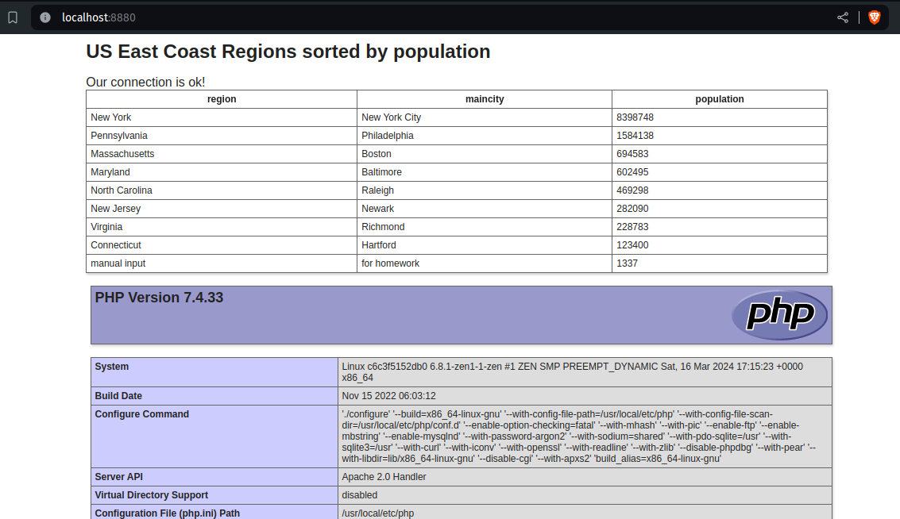

# Модуль 02. Сети и сетевые сервисы

## Задание

Вам необходимо использовать свои знания по поднятию сервисов и докер-контейнеров и реализовать систему из 3 контейнеров, где:

- Контейнер является веб-сервером и выводит содержимое базы данных.
- Контейнер является базой данных и содержит в себе базу данных MySQL, которая PHP-скриптом выводится на веб-страницу.
- Контейнер клиента для SQL-запросов в контейнер БД и изменения содержимого базы данных.

В качестве подтверждения выполнения задания необходимо приложить:

1. Код Dockerfile для образа контейнера с базой данных
2. Код PHP-скрипта для вывода содержимого базы данных
3. Код Docker-compose
4. Скриншот веб-страницы ДО изменения содержимого базы данных
5. SQL-запрос, отправленный в базу данных
6. Скриншот веб-страницы ПОСЛЕ изменения содержимого базы данных

## Мои комментарии

Для скриншотов выполненного задания пролистайте ниже этого блока.

Я модифицировал [предыдущее задание](https://github.com/XelorR/sf_infosec_01_linux_docker_apache_php_mysql), упростив контейнер с PHP (там я его полностью сам делал из дебиана, тут же взял базовый готовый образ и просто добавил поддержку mysql/mariadb)

Что я сделал сверх задания:

- доступ к базе данных через Adminer, для которого выделен отдельный порт для веб доступа
- использована концепция сетей докера, база данных недоступна с хоста, но доступна с контейнеров, притом контейнер **client** не видит **web** (ему и не надо)
- почитал какие ещё есть базы данных и какие версии сейчас считаются стабильными и выбрал MariaDB версии 10.4. В целом она --- форк MySQL, так что в данном задании она заменяет MySQL вполне прозрачно и полнофункционально. Но на докерхаб у неё меньше серьёзных уязвимостей, чем у MySQL 5.7, см. скриншоты:

## Скриншоты выполненного задания

Веб страница при запуске:

Запуск клиента и ввод авторизации:

Заглавная страница Админера:

Выполнение SQL команды, смотрим содержимое таблицы:

То же самое, но в консольном режиме, с логина в контейнер:

Добавляем строку чтобы показать изменения веб страницы:

Веб страница поменялась:

